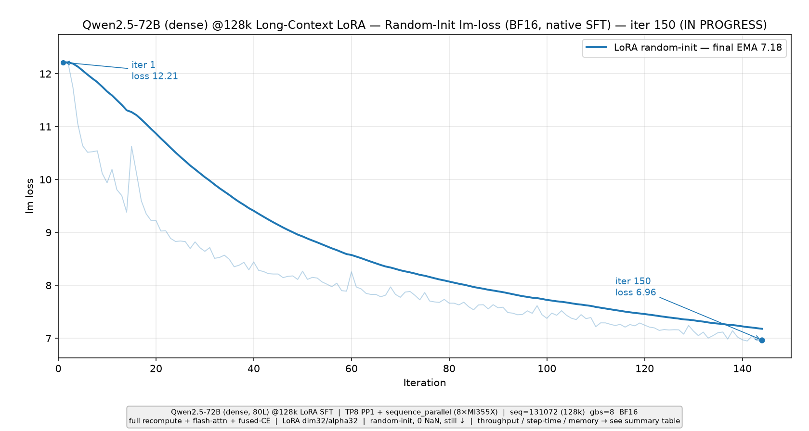

# Qwen3-235B-A22B (MoE) LoRA SFT —— 从 0 到 1 完整实验流程

在 **AMD MI355X + Slurm 集群**上，从零把 **Qwen3-235B-A22B（MoE，2350 亿参数 / 220 亿激活）的 LoRA SFT（BF16）** 跑起来。全程在**单个计算节点（8×MI355X，每卡 288 GB HBM）**上完成，照着下面 5 步复制命令即可复现。

> **说明：本流程默认使用「随机初始化」基座**（不加载真实 Qwen 权重），用于打通并验证「LoRA + MoE + BF16」训练全栈。此时起始 `lm loss ≈ 12`（≈ ln(词表大小)，符合预期）。若要微调**真实权重**，见文末[附录](#附录)。

---

## 目录

1. [环境与前置](#1-环境与前置)
2. [Step 1 — 克隆 Primus](#2-step-1--克隆-primus)
3. [Step 2 — 训练配置 YAML（完整内容）](#3-step-2--训练配置-yaml完整内容)
4. [Step 3 — 提交脚本（完整内容）](#4-step-3--提交脚本完整内容)
5. [Step 4 — 提交作业](#5-step-4--提交作业)
6. [Step 5 — 查看进度与读指标](#6-step-5--查看进度与读指标)
7. [实验结果](#7-实验结果)（7.1 Qwen3-235B-A22B ＋ 7.2 Qwen2.5-72B@128k）
   - [7.1 Qwen3-235B-A22B (MoE) 单机 LoRA](#71-qwen3-235b-a22b-moe-单机-lora)
   - [7.2 Qwen2.5-72B @128k 长上下文 LoRA](#72-qwen25-72b-128k-长上下文-lora)
8. [附录](#附录)

---

## 1. 环境与前置

| 项 | 值 / 说明 |
|---|---|
| 集群 | AMD MI355X GPU + Slurm 调度 |
| 计算节点 | **有 docker**，训练在容器里跑；每节点 **8×MI355X（288 GB HBM/卡）** |
| Slurm 参数 | 账号 `amd-taas-mk1`、分区 `amd-spur`、`--nodes=1` |
| 训练镜像 | `docker.io/rocm/primus:v26.2`（计算节点首次运行会自动 `docker pull`） |
| 工作目录 | 本文用 `/shared_nfs/botao`（共享盘，计算节点可见）；换成你自己的目录即可 |
| 其他 | 需要 `git`；**随机初始化流程不下载任何模型权重**，无需 HF token |

> **并行度（为什么单机能跑 235B）**：本流程用 `TP=1 / PP=1 / EP=8 / CP=1`（8 卡，DP=8）。EP=8 把 128 个专家分片到 8 张卡（每卡约 29B 参数 ≈ 58 GB），加上少量复制的非专家参数 + BF16 激活 + LoRA 适配器，实测每卡约占 205 GB / 288 GB，单机绰绰有余。

---

## 2. Step 1 — 克隆 Primus

```bash
cd /shared_nfs/botao
git clone --recurse-submodules -b feat/megatron/support-sft-native \
  https://github.com/AMD-AGI/Primus.git /shared_nfs/botao/Primus

# 若子模块没拉全，补一次（Megatron-LM 等）：
cd /shared_nfs/botao/Primus && git submodule update --init --recursive
```

克隆后仓库**自带**模型定义 `primus/configs/models/megatron/qwen3_235B_A22B.yaml` 和基础训练配置 `sft_trainer.yaml`（下一步的 YAML 会引用它们，**无需你改动**）。

---

## 3. Step 2 — 训练配置 YAML（完整内容）

新建文件 `/shared_nfs/botao/Primus/examples/megatron/configs/MI355X/qwen3_235B_A22B-BF16-lora-sft-1node.yaml`，**完整内容如下**（直接复制）：

```yaml
work_group: ${PRIMUS_TEAM:amd}
user_name: ${PRIMUS_USER:root}
exp_name: ${PRIMUS_EXP_NAME:qwen3_235B_A22B-lora-sft-1node}
workspace: ${PRIMUS_WORKSPACE:./output}

# =============================================================================
# Qwen3-235B-A22B (MoE) LoRA SFT, BF16 -- 单机 (8x MI355X) 版本。
# 并行度: TP=1  PP=1  EP=8  CP=1  ->  world = 8 GPUs = 1 node,  DP=8。
# MI355X 每卡 288 GB HBM; EP=8 时 235B 专家权重每卡分片约 29B (~58 GB)，
# 加少量复制的非专家参数 (~8 GB)，BF16 激活 + LoRA 适配器仍有大量余量。
# =============================================================================

modules:
  post_trainer:
    framework: megatron
    config: sft_trainer.yaml

    # 要跑的模型（仓库自带的模型定义）
    model: qwen3_235B_A22B.yaml

    overrides:
      # 选择 SFT trainer（必填）
      stage: sft

      hf_path: Qwen/Qwen3-235B-A22B
      tokenizer_model: Qwen/Qwen3-235B-A22B

      # SFT 数据
      sft_dataset_name: "tatsu-lab/alpaca"
      sft_conversation_format: "alpaca"

      # 日志
      wandb_project: "Primus_Qwen3_235B_A22B_SFT"
      stderr_sink_level: DEBUG
      log_avg_skip_iterations: 2
      log_avg_reset_interval: 10

      # 训练配置
      train_iters: 20
      micro_batch_size: 1
      global_batch_size: 128

      # 序列长度
      seq_length: ${PRIMUS_SEQ_LENGTH:4096}
      max_position_embeddings: ${PRIMUS_MAX_POSITION_EMBEDDINGS:4096}

      # 学习率（微调用较小值）
      lr: 1.0e-5
      min_lr: 0.0
      lr_warmup_iters: 50
      lr_decay_iters: 950
      lr_decay_style: cosine
      weight_decay: 0.1
      adam_beta1: 0.9
      adam_beta2: 0.95

      # 损失掩码
      eod_mask_loss: false  # SFT 用自定义 loss mask

      # 初始化
      init_method_std: 0.008
      norm_epsilon: 1.0e-6

      # 并行度 —— 单机 8 卡
      tensor_model_parallel_size: 1
      pipeline_model_parallel_size: 1
      pipeline_model_parallel_layout: null
      expert_model_parallel_size: 8
      context_parallel_size: 1
      sequence_parallel: false               # TP=1 时不启用 SP

      # 数据并行
      overlap_grad_reduce: true
      overlap_param_gather: true
      gradient_accumulation_fusion: false

      # 检查点
      # 注意: 没有 pretrained_checkpoint -> 冻结基座为「随机初始化」。
      # 要微调真实权重, 需先把 HF 权重转成 Megatron torch_dist,
      # 再把 pretrained_checkpoint 指向该目录（见 README 附录）。
      finetune: true
      load: null
      save: null
      save_interval: 100
      eval_interval: 50
      no_save_optim: null
      no_save_rng: null
      disable_last_saving: true
      ckpt_format: torch

      # 精度（BF16 混合精度）
      bf16: true

      # Turbo 优化
      enable_primus_turbo: true
      use_turbo_attention: false
      use_turbo_grouped_mlp: false

      # deepep（MoE 通信）
      use_turbo_deepep: true
      moe_shared_expert_overlap: false
      moe_router_dtype: fp32
      turbo_deepep_num_cu: 64
      turbo_deepep_use_comm_stream: false
      turbo_sync_free_moe_stage: 1

      # 验证
      eval_iters: 10

      # LoRA 配置
      lora:
        enabled: true
        dim: 32
        alpha: 32
        dropout: 0.0
        dropout_position: pre
        lora_A_init_method: xavier
        lora_B_init_method: zero
        target_modules:
          - linear_qkv
          - linear_proj
          - linear_fc1
          - linear_fc2
```

**关键字段速览**

| 字段 | 值 | 含义 |
|---|---|---|
| `stage` | `sft` | 走 SFT 训练器 |
| `tensor/pipeline/expert_model_parallel_size` | `1 / 1 / 8` | 单机 8 卡，专家 8 路并行 |
| `bf16` | `true` | BF16 混合精度 |
| `sft_dataset_name` | `tatsu-lab/alpaca` | 训练数据集（Alpaca 指令数据） |
| `seq_length` / `global_batch_size` | `4096` / `128` | 序列长度 / 全局 batch |
| `train_iters` | `20` | 迭代步数 |
| `lora.enabled` | `true` | 启用 LoRA（dim 32 / alpha 32，只训 ~0.3% 参数） |
| 无 `pretrained_checkpoint` | — | 基座随机初始化（loss≈12） |

---

## 4. Step 3 — 提交脚本（完整内容）

新建文件 `/shared_nfs/botao/submit_qwen3_235b_lora_1node.sh`，**完整内容如下**（作用：在计算节点上用 docker 起 Primus 容器、挂载仓库与缓存、在容器里跑 `examples/run_pretrain.sh`）：

```bash
#!/bin/bash
###############################################################################
# 单机提交脚本: Qwen3-235B-A22B (MoE) LoRA SFT, BF16, Primus 原生 SFT-LoRA 路径
# (分支 feat/megatron/support-sft-native)。
# 并行度: TP1 x PP1 x EP8 x CP1 -> 8 GPUs, DP=8。单节点 8x MI355X (288GB/卡)。
###############################################################################
#SBATCH --job-name=qwen3_235b_lora_1n
#SBATCH --account=amd-taas-mk1
#SBATCH --partition=amd-spur
#SBATCH --nodes=1
#SBATCH --time=03:00:00
#SBATCH --output=/shared_nfs/botao/logs/qwen3_235b_lora_1node.%j.out
#SBATCH --error=/shared_nfs/botao/logs/qwen3_235b_lora_1node.%j.err

set -uo pipefail

# ----------------------------- 配置 --------------------------------
HOST_PRIMUS=/shared_nfs/botao/Primus
HOST_HF_CACHE=/shared_nfs/botao/hf_cache
HOST_CACHE_PERSIST=/shared_nfs/botao/cache_persist
CTR_PRIMUS=/workspace/Primus
CTR_HF_CACHE=/shared_nfs/botao/hf_cache

DOCKER_IMAGE=${DOCKER_IMAGE:-docker.io/rocm/primus:v26.2}
EXP_REL=${EXP_REL:-examples/megatron/configs/MI355X/qwen3_235B_A22B-BF16-lora-sft-1node.yaml}
export PRIMUS_EXP_NAME=${PRIMUS_EXP_NAME:-qwen3_235B_A22B_lora_sft_bf16_1node}
CTR_NAME="primus_${SLURM_JOB_ID}"

echo "=========================================================================="
echo " Qwen3-235B-A22B (MoE) LoRA SFT BF16  |  Primus native SFT-LoRA (1 node)"
echo "--------------------------------------------------------------------------"
echo " job_id          : ${SLURM_JOB_ID}"
echo " host            : $(hostname)"
echo " docker_image    : ${DOCKER_IMAGE}"
echo " exp             : ${EXP_REL}"
echo " primus_exp_name : ${PRIMUS_EXP_NAME}"
echo " start           : $(date)"
echo "=========================================================================="

if ! command -v docker >/dev/null 2>&1; then
    echo "ERROR: docker not found on compute node $(hostname)" >&2
    exit 127
fi

docker rm -f "${CTR_NAME}" >/dev/null 2>&1 || true

if ! docker image inspect "${DOCKER_IMAGE}" >/dev/null 2>&1; then
    echo "pulling ${DOCKER_IMAGE} ..."
    docker pull "${DOCKER_IMAGE}" || { echo "ERROR: docker pull failed" >&2; exit 1; }
fi

IB_DEV=()
[ -e /dev/infiniband ] && IB_DEV=(--device=/dev/infiniband)

docker run --rm --name "${CTR_NAME}" \
    --ipc=host --network=host \
    --device=/dev/kfd --device=/dev/dri "${IB_DEV[@]}" \
    --cap-add=SYS_PTRACE --cap-add=CAP_SYS_ADMIN \
    --security-opt seccomp=unconfined --group-add video \
    --privileged --ulimit core=0:0 \
    -e MASTER_ADDR=localhost \
    -e MASTER_PORT=$((20000 + SLURM_JOB_ID % 10000)) \
    -e NNODES=1 \
    -e NODE_RANK=0 \
    -e GPUS_PER_NODE=8 \
    -e EXP="${EXP_REL}" \
    -e PRIMUS_EXP_NAME="${PRIMUS_EXP_NAME}" \
    -e HF_HOME="${CTR_HF_CACHE}" \
    -e HF_HUB_CACHE="${CTR_HF_CACHE}/hub" \
    -e HF_DATASETS_CACHE="${CTR_HF_CACHE}/datasets" \
    -e PRIMUS_CACHE_ROOT=/workspace/cache_persist \
    -e PYTORCH_HIP_ALLOC_CONF=expandable_segments:True \
    -e HSA_NO_SCRATCH_RECLAIM=1 \
    -e NVTE_CK_USES_BWD_V3=1 \
    -e GPU_MAX_HW_QUEUES=2 \
    -e NCCL_SOCKET_IFNAME=lo \
    -e GLOO_SOCKET_IFNAME=lo \
    -e NCCL_IB_DISABLE=1 \
    -e TRAIN_LOG="${CTR_PRIMUS}/output/train_stdout_1node.log" \
    -v "${HOST_PRIMUS}":"${CTR_PRIMUS}" \
    -v "${HOST_HF_CACHE}":"${CTR_HF_CACHE}" \
    -v "${HOST_CACHE_PERSIST}":/workspace/cache_persist \
    -w "${CTR_PRIMUS}" \
    "${DOCKER_IMAGE}" \
    /bin/bash -lc "cd ${CTR_PRIMUS} && bash examples/run_pretrain.sh"
rc=$?

echo "=========================================================================="
echo " container exited rc=${rc}   end: $(date)"
echo "=========================================================================="
exit $rc
```

赋予执行权限：

```bash
chmod +x /shared_nfs/botao/submit_qwen3_235b_lora_1node.sh
```

> **脚本在做什么（新手向）**：`#SBATCH` 那几行告诉 Slurm 申请 1 个 `amd-spur` 分区的节点（账号 `amd-taas-mk1`）。脚本体在分到的**计算节点**上执行：检查 docker → 拉镜像 → `docker run` 起容器（`--device=/dev/kfd --device=/dev/dri` 暴露全部 8 张 GPU，`-v` 把仓库/缓存挂进容器）→ 容器里执行 `bash examples/run_pretrain.sh`，它读取 `EXP` 指向的 YAML 启动训练。

---

## 5. Step 4 — 提交作业

```bash
cd /shared_nfs/botao
mkdir -p logs hf_cache cache_persist          # 首次运行先建好目录
sbatch submit_qwen3_235b_lora_1node.sh
```

想指定某个空闲节点（可选）：

```bash
sbatch --nodelist=<空闲节点名> submit_qwen3_235b_lora_1node.sh
```

---

## 6. Step 5 — 查看进度与读指标

```bash
# 看作业是否在跑
squeue -u "$USER"

# 跟训练日志（Slurm stdout，%j 是 job id）
tail -f /shared_nfs/botao/logs/qwen3_235b_lora_1node.*.out
```

每个 step 会打印一行形如：

```text
iteration        5/      20 | elapsed time per iteration (ms): 35000.0 | throughput per GPU (TFLOP/s/GPU): 275.7 | lm loss: 1.20E+01 | number of nan iterations: 0 | rocm mem usage/free/total/usage_ratio: 205GB/83GB/288GB/71%
```

**如何判断跑得对：**

| 指标 | 预期值 | 含义 |
|---|---|---|
| `throughput per GPU (TFLOP/s/GPU)` | 稳态 **~275** | 单卡算力吞吐（前 2 步含编译预热会偏低） |
| `elapsed time per iteration` | **~35 s/步** | 每步耗时 |
| `lm loss` | **~12**（随机初始化） | 交叉熵损失；随机基座 ≈ ln(词表) |
| `number of nan iterations` | **0** | 无 NaN 才健康 |
| `rocm mem usage` | 每卡 **~205 GB / 288 GB** | 显存占用（约 71%，单机装得下） |

---

## 7. 实验结果

本节给出**两个**实验的实测结果，均为**单节点 8×MI355X、随机初始化、Primus 原生 SFT-LoRA（BF16）** 路径，各自附「`lm loss` 收敛曲线图 + 结果指标汇总表」（吞吐、单步耗时、显存等稳态指标列在各自的汇总表里）：**7.1** 为 Qwen3-235B-A22B (MoE) 已完整跑完 500 步的单机 LoRA；**7.2** 为 Qwen2.5-72B 在 **128k 长上下文**下的 LoRA（作业仍在训练中，用当前数据）。

### 7.1 Qwen3-235B-A22B (MoE) 单机 LoRA

把 `train_iters` 调大到 **500** 跑完整收敛，本次作业已**完整跑完 500/500 步**（全程 **0 NaN**，训练墙钟约 **5.2 小时**）。随机初始化 LoRA 的 `lm loss` 从第 1 步的 **12.06** 快速下降，约在**第 60–80 步**进入 **~9.4** 的平台（随机基座 + 低秩 LoRA 能达到的固有下限，之后不再明显下降），最终第 500 步收在 **9.41**。下图为完整 500 步的 `lm loss` 收敛曲线（稳态吞吐、单步耗时、每卡显存等见后面的汇总表）：


> 图为完整 500 步的 `lm loss` 曲线：淡线为原始逐步值、粗线为 EMA(α=0.05) 平滑；已标注 iter 1（12.06）与 iter 500（9.41）。稳态吞吐、单步耗时与每卡显存等指标见下方汇总表。

#### 结果指标汇总表

下表为本次 **Qwen3-235B-A22B 单机 LoRA SFT（随机初始化）** 跑完 500 步后的实测指标，全部取自作业日志 `logs/qwen3_235b_lora_1node_converge2.18718.out`（稳态口径为 iter ≥ 11，剔除前若干步编译预热）：

| 指标 | 数值 |
|---|---|
| 模型 / 结构 | Qwen3-235B-A22B（MoE，2350 亿总参 / 220 亿激活，128 专家） |
| 并行度 | TP=1 / PP=1 / EP=8 / CP=1（8×MI355X，DP=8，单节点） |
| 精度 | BF16 混合精度 |
| LoRA | dim=32 / alpha=32、dropout=0，4 个 target module（`linear_qkv` / `linear_proj` / `linear_fc1` / `linear_fc2`），约 0.3% 可训练参数 |
| 数据集 | `tatsu-lab/alpaca`（alpaca 格式），seq_length=4096，global_batch_size=128，micro_batch_size=1 |
| 训练步数 | **500 / 500**（完整跑完） |
| 稳态吞吐 | 中位数 **~272 TFLOP/s/GPU**（均值 ~265，多数步落在 234–293） |
| 单步耗时 | 中位数 **~35.7 s**（均值 ~37.7 s，多数步落在 33–41 s） |
| 每卡显存 | rocm 占用 **~206 GB / 288 GB**（~72%），峰值 **~212.6 GB**（~74%） |
| 起始 → 终点 loss | **12.06 → 9.41**（约第 80 步进入 ~9.4 平台） |
| NaN 迭代数 | **0** |
| 训练墙钟 | **~313 min（≈ 5.2 h）**，iter 1→500 |

### 7.2 Qwen2.5-72B @128k 长上下文 LoRA

**Qwen2.5-72B（稠密 dense，80 层）在 128k 长上下文下的 LoRA SFT**（BF16、随机初始化、单节点 8×MI355X）。与 7.1 最大的不同是**极长序列**：`seq_length=131072`（128k）、`global_batch_size=8`（每步约 **105 万 token**），靠 **TP=8 + `sequence_parallel`**（不用 CP —— 原生 SFT 前向暂不支持 CP 序列切分）配合**全量激活重算 + flash-attn + 融合 CE**，把每卡显存压到约 **64 GB**。该作业**仍在训练中**，`lm loss` 从第 1 步的 **12.21** 持续降到**截至 iter 150** 的 **6.96**（**仍在下降、尚未走平**），全程 **0 NaN**。下图为该 `lm loss` 收敛曲线（稳态吞吐、单步耗时、每卡显存等见后面的汇总表）：



> 图为 `lm loss` 曲线：淡线为原始逐步值、粗线为 EMA(α=0.05) 平滑；已标注 iter 1（12.21）与截至 iter 150 的 **6.96**，曲线**仍单调下降、尚未走平**。稳态吞吐、单步耗时与显存见下方汇总表。（显存补充：日志中 `rocm mem usage` 恒为 ~64 GB ＝存活张量，而 `hip mem usage` 会间歇冲到接近满卡，是 128k 激活 + `expandable_segments` 分配器预留所致，属预期现象。）

#### 结果指标汇总表

下表为本次 **Qwen2.5-72B @128k 长上下文 LoRA SFT（随机初始化）** 的实测指标，全部取自作业日志 `logs/qwen25_72b_lora128k_1node.18732.out`，为**截至 iter 150** 的快照（稳态口径 iter ≥ 11）：

| 指标 | 数值 |
|---|---|
| 模型 / 结构 | Qwen2.5-72B（稠密 dense，80 层，约 720 亿参数） |
| 并行度 | TP=8 / PP=1 / CP=1 + `sequence_parallel`（8×MI355X，单节点；SFT 前向不支持 CP 序列切分，故用 SP） |
| 精度 | BF16 混合精度（全量激活重算 + flash-attn + 融合 CE） |
| 上下文长度 | **131072（128k）** |
| LoRA | dim=32 / alpha=32，4 个 target module（`linear_qkv` / `linear_proj` / `linear_fc1` / `linear_fc2`），约 0.5% 可训练参数 |
| 数据集 | `tatsu-lab/alpaca`（打包到 128k），global_batch_size=8（每步 ~105 万 token） |
| 当前步数 | **截至 iter 150** |
| 稳态吞吐 | 洁净步 **~655 TFLOP/s/GPU**（中位数 ~637、均值 ~605，含周期性掉速） |
| 单步耗时 | 洁净步 **~188 s**（中位数 ~194 s、均值 ~212 s） |
| 每卡显存 | rocm 占用 **~64 GB / 288 GB（~22%）**（峰值 rocm max ~63.9 GB，~22%） |
| 起始 → 当前 loss | **12.21 → 6.96** |
| NaN 迭代数 | **0** |
| 已训练用时 | **~501 min** |

---

## 附录

### A. 跑更多 iter / 看收敛（重要：先真正禁用存盘）

把 YAML 里的 `train_iters` 调大（如 `500`）即可。**但一定要真正关闭 checkpoint 保存**，否则默认每 `save_interval` 步会写一次**全量 checkpoint**（235B 一次约 0.5–1.1 TB），会把共享盘撑爆。把 YAML 改成：

```yaml
      train_iters: 500
      save: null
      save_interval: 1000000     # 远大于 train_iters, 相当于永不周期保存
      disable_last_saving: true  # 末次也不保存
      eval_iters: 0              # 关闭评估开销
```

### B. 微调「真实」Qwen3-235B-A22B 权重（可选）

上面是随机初始化（loss≈12，用于验证训练栈）。要微调真实权重：

1. 下载 HF 权重（公开模型，无需 token）：`Qwen/Qwen3-235B-A22B`（约 470 GB）。
2. 用 **Megatron-Bridge** 的 `AutoBridge.import_ckpt` 把 HF 权重转成 Megatron `torch_dist` 格式。
3. 在 YAML 里加 `pretrained_checkpoint: <转换输出目录>`（保持 `finetune: true`、`ckpt_format: torch_dist`）。

加载正确后，第 1 步 `lm loss` 就会从 **~1.6**（而非 ~12）起——这即是「真实权重已生效」的判据。
