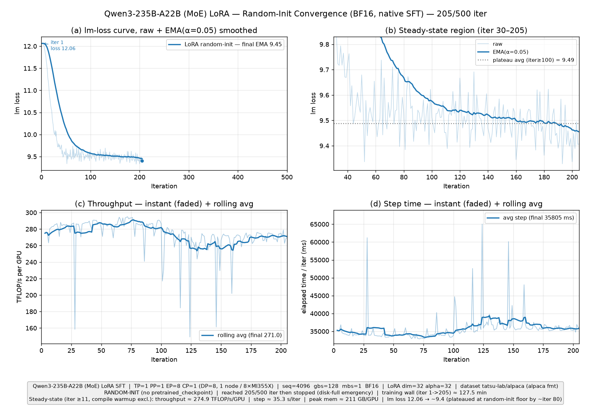

# AMD MI355X + 类-Slurm 集群实验完整工作流指南（小白也能照着跑）

> 面向对象：**从没碰过本集群、也不熟悉 Megatron/Primus 的新人**。
> 只要照着本文一步步复制命令，就能把我们跑过的 **两条实验线**从零复现到出结果。
>
> 两条实验线：
> - **实验线 A：Qwen3-235B-A22B（MoE，2350 亿参数 / 220 亿激活）** —— 单机 LoRA、4 节点 LoRA、全参对照（OOM/放下）、真实权重微调、收敛跑，共 5 个子实验。
> - **实验线 B：Qwen2.5-72B（稠密）@ 128k 超长上下文 LoRA** —— 单机把 13.1 万 token 序列塞进 8 张卡的显存策略。
>
> 所有文件都在 `/shared_nfs/botao/` 下。所有命令都尽量做到**复制即用**。
> 本文基于仓库里的**真实脚本、真实配置、真实日志**编写，数值均来自实跑日志。

---

> **示例结果**：下图为 Qwen3-235B-A22B 单机 LoRA（随机初始化）的收敛与吞吐 4 面板总结图（详见「实验线 A5」）。
>
> 

---

## 目录

1. [概述（目标 + 两条线一览 + 结论表）](#1-概述)
2. [集群与环境](#2-集群与环境)
3. [一次性准备（clone 仓库 + 目录布局 + 镜像）](#3-一次性准备)
4. [核心原理（新手必读）](#4-核心原理新手必读)
5. [实验线 A：Qwen3-235B-A22B（MoE）](#5-实验线-aqwen3-235b-a22bmoe)
   - [A1 单机 LoRA](#a1-单机-lora冒烟--基线)
   - [A2 多机 4 节点 LoRA](#a2-多机-4-节点-lora32-gpu)
   - [A3 全参对照（full-FT）](#a3-全参对照full-ft单机-oom4-节点放下)
   - [A4 真实权重微调](#a4-真实权重微调download--convert--validate--train)
   - [A5 收敛跑](#a5-收敛跑500-iter存盘彻底禁用)
6. [实验线 B：Qwen2.5-72B @128k 长上下文 LoRA](#6-实验线-bqwen25-72b-128k-长上下文-lora)
7. [监控与读数（日志路径 + 指标字段）](#7-监控与读数)
8. [关键坑与排错（现象→原因→解决）](#8-关键坑与排错重点)
9. [文件清单](#9-文件清单shared_nfsbotao-下相关文件)
10. [快速开始（复制即用命令块）](#10-快速开始复制即用)

---

## 1. 概述

### 1.1 目标
在 **AMD Instinct MI355X + 定制类-Slurm 调度器**的集群上，用 **Primus 原生（native）SFT-LoRA 路径**（分支 `feat/megatron/support-sft-native`），把大模型微调训练**跑通、测性能、看收敛动态**。

### 1.2 两条实验线一览

| 线 | 模型 | 结构 | 子实验 | 用途 |
|---|---|---|---|---|
| **A** | Qwen3-235B-A22B | MoE（128 专家，top-8） | A1 单机 LoRA / A2 4节点 LoRA / A3 全参对照 / A4 真实权重 / A5 收敛跑 | MoE 大模型的性能/显存/多机/真微调全流程 |
| **B** | Qwen2.5-72B | 稠密（80 层） | 单机 128k 长上下文 LoRA | 超长上下文（13.1 万 token）单机显存策略 |

### 1.3 最终结论（性能 / 显存 / loss 概览表）

> 数据集统一 `tatsu-lab/alpaca`（alpaca 对话格式）；BF16 混合精度；LoRA `dim=32 alpha=32`。
> "单卡显存"给的是**稳态当前占用（rocm mem usage）** 与 **峰值（rocm max mem usage）**。
> 吞吐单位 **TFLOP/s/GPU**（每卡每秒万亿次浮点运算），均取**稳态**（剔除前 2 步编译预热）。

| 子实验 | job id | 规模 | 模式 | 序列长度 | 吞吐/卡 | 单步耗时 | 单卡显存 | iter-1 loss | 结论 |
|---|---|---|---|---|---|---|---|---|---|
| A1 单机 LoRA（冒烟 20 iter） | 17733 | 1×8=8 | LoRA 随机 | 4096 | **~275** | ~35 s | ~205GB（峰~211） | 12.06 | 单卡效率上限区 |
| A2 4 节点 LoRA（20 iter） | 17964 | 4×8=32 | LoRA 随机 | 4096 | **~79** | ~31 s | ~122GB（峰~242） | 12.07 | 跨节点通信开销大 |
| A3a 单机 full-FT | 18281 | 1×8=8 | 全参 随机 | 4096 | **OOM** | — | 282/288GB 撑爆 | — | **单机放不下** |
| A3b 4 节点 full-FT（30 iter） | 18440 | 4×8=32 | 全参 随机 | 4096 | **~72** | ~32 s | ~166GB（峰~185） | 12.08 | 靠分布式优化器+全量重算放下 |
| A4 单机 LoRA 真实权重（20 iter） | 18310 | 1×8=8 | LoRA 真实 | 4096 | **~205** | ~46 s | ~169GB（峰~170） | **1.67** | 真微调，loss≈1.6 |
| A5 单机 LoRA 收敛（500 iter） | 18718 | 1×8=8 | LoRA 随机 | 4096 | **~289** | ~34 s | ~206GB（峰~213） | 12.06→~9.4 | 随机地板附近收敛 |
| B 单机 72B @128k（500 iter） | 18732 | 1×8=8 | LoRA 随机 | **131072** | **~657** | ~188 s | **~64GB（~22%）** | 12.21→… | 128k 单机塞下，显存富余 |

**一句话看懂几个反直觉点：**
- **随机初始化**的 loss 从 ~12 开始（≈ `ln(词表≈15.2万)` ≈ 11.9），因为 base 是随机权重、只训 ~0.3% 的 LoRA 适配器，所以只会降到一个"**地板**"（235B 约 9.4）而**不是**真实微调的低点。它用来验证**技术栈和性能**，不是真微调。
- **真实权重**（A4）iter-1 loss ≈ **1.67**，这才是"真微调"的起点。
- **A4 吞吐（~205）比 A1（~275）低**：因为 A4 额外开了**全量激活重算**（`recompute_granularity=full`）来腾显存装真实权重，重算换显存、代价是算力。
- **B（72B@128k）吞吐高达 ~657**：128k 长序列让每步的有效算力利用率非常高；显存只用 ~22%，因为用了 **TP8 + 序列并行 + 全量重算 + flash-attn + 融合交叉熵**。

---

## 2. 集群与环境

| 项目 | 值 |
|---|---|
| 加速器 | AMD Instinct **MI355X**，每卡 **288 GB** HBM（日志里 `total 287.98GB`） |
| 每节点 | **8 张 MI355X** + 约 **2.75 TB** 主机内存（转换 235B 权重需 ~470GB RAM） |
| 调度器 | **定制的类-Slurm 调度器**：`sbatch` / `squeue` / `sinfo` / `scontrol` 可用 |
| 登录节点 | **`crs-m2m-cpu-spur-012`**：**没有 docker**，只能提交作业、读日志、跑轻量 Python |
| 计算节点 | **`crsuse2-m2m-XXX`**（XXX 为编号，如 `crsuse2-m2m-191`）：**有 docker**（server 29.x），训练在特权容器里跑 |
| 账户 account | **`amd-taas-mk1`** |
| 分区 partition | **`amd-spur`** |
| QoS | **不用手动设**：`--qos` 由调度器**自动**分配（脚本里不写 `--qos`） |
| 用户 | `botahu` |
| 共享盘 | `/shared_nfs`（NFS，**50 TB**，长期 **~99% 占用**，空闲仅 ~0.9–1.5 TB —— **磁盘极其紧张**） |

### 2.1 常用调度命令（在登录节点执行）

```bash
# 看分区/节点空闲情况
sinfo
sinfo -p amd-spur -o "%n %t %C"     # 节点名 / 状态 / CPU(A/I/O/T)

# 看自己的作业队列
squeue -u botahu
squeue -u botahu -o "%.8i %.20j %.2t %.10M %R"   # jobid/名字/状态/已运行时长/节点或原因

# 看某个 job 的细节（落在哪个节点、状态）
scontrol show job <JOBID> | grep -E 'JobState|NodeList|RunTime'

# 提交 / 取消
sbatch <脚本>.sh          # 返回 "Submitted batch job <JOBID>"
scancel <JOBID>
```

> **重要：本集群 `sacct` 不可靠。** 历史作业的统计（用量、退出码等）经常查不到或不准，**不要依赖 `sacct`**。要看结果就直接读 `logs/<name>.<jobid>.out`（见 §7）。

### 2.2 三条硬约束（决定了后面所有"奇怪"的做法）

1. **调度器无法把一个 job step 跨节点 fan-out。** `srun`（即便带 `-N/-n/-w/--container-image`）只会在**头节点**起进程；`--ntasks-per-node`/`-w` 被忽略；节点间 SSH 被拒（publickey）；`--exclusive` → `JobLaunchFailure`；`--gpus-per-node` → 作业被 hold。
   → 多机训练**不能**用常规 `srun` 编排，必须用"**N 个独立单机作业 + 共享盘文件 rendezvous + torchrun**"（见 §5-A2）。
2. **调度器不隔离 GPU。** 别的会话的**特权容器**会绕过调度器的 GPU 记账，所以一个 Slurm 显示 "idle" 的节点上**可能已经被别人占满显存**。
   → **提交前必须做 GPU 空闲预检**（`gpu_free_count.py`，见 §8-坑3）。
3. **`--nodes=1` 的普通作业独占整台 8 卡节点**，特权容器内可见全部 8 张 MI355X。

---

## 3. 一次性准备

### 3.1 克隆 Primus 仓库（含子模块）

```bash
# 在登录节点执行；仓库放到 /shared_nfs/botao/Primus
git clone --recurse-submodules \
  -b feat/megatron/support-sft-native \
  https://github.com/AMD-AGI/Primus.git \
  /shared_nfs/botao/Primus
```

- `--recurse-submodules` **必须加**：Primus 把 Megatron 等作为 **git 子模块**，不加会缺代码。本仓库的子模块（`git submodule status` 实测）：
  - `third_party/Megatron-LM`（`25.04-alpha.rc1-...`）—— 训练后端
  - `third_party/Megatron-Bridge`（`v0.2.0rc6-...`）—— HF↔Megatron 权重转换（A4 用）
  - 还有 `Emerging-Optimizers` / `HummingbirdXT` / `maxtext` / `torchtitan`
- 分支 **`feat/megatron/support-sft-native`** 提供**原生 SFT-LoRA** 训练路径（`primus/modules/trainer/megatron/` + `primus/backends/megatron/`）。
- 若克隆时子模块没拉全（网络问题），可事后补：
  ```bash
  cd /shared_nfs/botao/Primus && git submodule update --init --recursive
  ```

### 3.2 目录布局（`/shared_nfs/botao/`）

```
/shared_nfs/botao/
├── Primus/                      # 训练框架仓库（分支 feat/megatron/support-sft-native）
│   ├── examples/
│   │   ├── run_pretrain.sh      # 容器内真正拉起 torchrun 的入口脚本
│   │   └── megatron/configs/MI355X/   # 我们所有实验的 .yaml 配置
│   ├── primus/configs/          # 基础配置（模型定义、sft_trainer.yaml 等）
│   └── output/amd/root/<EXP>/   # 训练产物（logs/、checkpoints/）—— 见 §7
├── logs/                        # Slurm 作业输出：<name>.<jobid>.out / .err
├── hf_cache/                    # HuggingFace 缓存（HF_HOME）：hub/(权重) + datasets/(数据)
├── megatron_ckpts/qwen3_235B_A22B/  # A4 转换出的真实权重 torch_dist 检查点（root 属主，~470GB）
├── cache_persist/               # 内核/JIT 持久缓存（triton/inductor/miopen/hipblaslt 调优）
├── rdzv/<RUNID>/                # 多机文件 rendezvous 目录（rank-i/、master）
├── *.sh / *.py                  # 提交脚本、转换脚本、工具脚本（见 §9）
└── EXPERIMENTS_GUIDE.md         # 本文档
```

> 训练脚本里出现的 `HOST_*`（宿主机路径）会被 `docker -v` 挂载成容器内的 `CTR_*`（容器路径）。
> 最常见的一对：`/shared_nfs/botao/Primus`（宿主）↔ `/workspace/Primus`（容器）。

### 3.3 Docker 镜像

- 统一镜像：**`docker.io/rocm/primus:v26.2`**（内含 ROCm、PyTorch、Megatron、matplotlib、huggingface_hub 等）。
- **只在计算节点上**通过 `docker run` 使用（登录节点没有 docker）。
- 提交脚本会自动检查镜像是否存在，缺了会 `docker pull`：
  ```bash
  docker image inspect docker.io/rocm/primus:v26.2 || docker pull docker.io/rocm/primus:v26.2
  ```

---

## 4. 核心原理（新手必读）

### 4.1 一次训练是怎么跑起来的？

整条链路（**记住这张图，后面所有实验都是它的变体**）：

```
你在登录节点  ──sbatch──▶  调度器把作业丢到某个计算节点 crsuse2-m2m-XXX
                                    │
                                    ▼
              计算节点上执行提交脚本里的 docker run（特权容器）
              docker run --privileged --ipc=host --network=host \
                --device=/dev/kfd --device=/dev/dri \   # 把 AMD GPU 暴露进容器
                -e EXP=<某个.yaml> -e NNODES=.. -e NODE_RANK=.. \
                -v /shared_nfs/botao/Primus:/workspace/Primus \
                rocm/primus:v26.2  bash examples/run_pretrain.sh
                                    │
                                    ▼
              容器内 run_pretrain.sh 组装并执行：
              torchrun --nproc_per_node 8 --nnodes N --node_rank i \
                       --master_addr <..> --master_port <..> \
                       primus/cli/main.py train pretrain --config $EXP
```

关键点：
- **`--device=/dev/kfd --device=/dev/dri`** 是 AMD ROCm 把 GPU 暴露进容器的标准做法（相当于 NVIDIA 的 `--gpus all`）。
- **`--ipc=host --network=host --privileged`** 让容器能用满共享内存、走宿主网络、拿到调 GPU 需要的权限。
- **`-e EXP=<yaml>`** 指定这次跑哪个实验配置 —— **这是你切换实验的唯一开关**。
- `run_pretrain.sh` 先 `pip install -r requirements.txt`（幂等，很快），再跑 `prepare_experiment.py` 把 yaml 展开成 Megatron 参数，最后用 **torchrun** 拉起 8 个进程（每卡一个）。

### 4.2 配置是怎么拼出来的？（三层）

一个实验的最终参数 = **三层合并**：

```
模型定义 yaml          +   基础训练器 yaml         +   实验 overrides
qwen3_235B_A22B.yaml       sft_trainer.yaml            <EXP>.yaml 里 overrides: 段
(层数/隐藏维/专家数..)      (默认迭代/优化器/LoRA默认)    (并行度/LR/存盘策略..)
```

- 模型定义有继承链：
  `qwen3_235B_A22B.yaml` → `extends: qwen2.5_base.yaml` → `extends: llama_base.yaml`。
  同理 `qwen2.5_72B.yaml` → `qwen2.5_base.yaml` → `llama_base.yaml`。
- 基础训练器 `primus/configs/modules/megatron/sft_trainer.yaml` → `extends: trainer_base.yaml`，定义了 SFT 默认值（`stage: sft`、`use_flash_attn: true`、`ckpt_format: torch_dist`、`auto_detect_ckpt_format: true`、LoRA 默认关等）。
- 实验 yaml 里 `modules.post_trainer.overrides:` 段的字段**覆盖**上面两层。**你 99% 的调参都在这一段。**

`qwen3_235B_A22B.yaml` 关键模型字段（实测）：
```yaml
num_layers: 94            # 94 层
hidden_size: 4096
ffn_hidden_size: 12288
num_attention_heads: 64
num_experts: 128          # MoE：128 个专家
moe_router_topk: 8        # 每 token 选 8 个专家
moe_ffn_hidden_size: 1536
num_query_groups: 4       # GQA（分组查询注意力）
position_embedding_type: rope
rotary_base: 1000000
```

`qwen2.5_72B.yaml` 关键字段（实测）：
```yaml
hidden_size: 8192
ffn_hidden_size: 29568
num_layers: 80
num_attention_heads: 64
num_query_groups: 8       # GQA
# 继承 qwen2.5_base.yaml：max_position_embeddings=131072, rotary_base=1e6
```

### 4.3 并行度含义（TP/PP/EP/CP/SP/DP）—— 大模型分布式的 ABC

| 缩写 | 全称 | 干什么 | 本文取值举例 |
|---|---|---|---|
| **TP** | Tensor Parallel（张量并行） | 把**单层的权重矩阵**切到多张卡上一起算 | 235B 用 TP=1；72B@128k 用 TP=8 |
| **PP** | Pipeline Parallel（流水线并行） | 把**不同层**分到不同卡组，像流水线一样传递 | 235B 单机 PP=1；4 节点 PP=4 |
| **EP** | Expert Parallel（专家并行） | **MoE 专属**：把 128 个专家分摊到多卡（每卡只放一部分专家） | 235B 用 EP=8 |
| **CP** | Context Parallel（上下文并行） | 把**序列长度**切到多卡（超长上下文用） | 本文都 CP=1（见 §6 为何不用 CP） |
| **SP** | Sequence Parallel（序列并行） | 在 TP 基础上，把 LayerNorm/dropout 的激活也沿序列切 | 需 TP>1；72B@128k 开，235B(TP1) 关 |
| **DP** | Data Parallel（数据并行） | 剩下的卡各自吃不同的数据批，梯度 all-reduce | 由公式**推导**出来 |

**世界大小（world_size）与 DP 的推导公式**（务必记住）：
```
world_size = 每节点GPU数 × 节点数 = GPUS_PER_NODE × NNODES
world_size = TP × PP × CP × DP          →   DP = world_size / (TP × PP × CP)
EP 在 DP 维度内切专家：要求 EP 整除 (world_size / (TP×PP×CP)) = DP
```
- A1 单机：`8 = TP1 × PP1 × CP1 × DP` → **DP=8**；EP=8 把专家摊到这 8 张卡。
- A2 4 节点：`32 = TP1 × PP4 × CP1 × DP` → **DP=8**；EP=8。
- B 72B@128k：`8 = TP8 × PP1 × CP1 × DP` → **DP=1**。

### 4.4 LoRA 块字段解释

```yaml
lora:
  enabled: true            # 开 LoRA（false=全参微调）
  dim: 32                  # 低秩维度 r（越大越强、越占显存；8~64 常见）
  alpha: 32                # 缩放因子（一般 = dim）
  dropout: 0.0
  dropout_position: pre
  lora_A_init_method: xavier   # A 矩阵 Xavier 初始化
  lora_B_init_method: zero     # B 矩阵零初始化（保证训练开始时适配器输出=0，不扰动 base）
  target_modules:              # 给哪些线性层挂适配器
    - linear_qkv     # 注意力 QKV 投影
    - linear_proj    # 注意力输出投影
    - linear_fc1     # FFN 第一层
    - linear_fc2     # FFN 第二层
```
LoRA 只训这些低秩适配器（占总参数 **~0.3%**），base 权重冻结 → 显存和算力都省很多。

### 4.5 数据集

- 统一用 **`tatsu-lab/alpaca`**（HuggingFace 上的经典指令数据集，约 5.2 万条短样本）。
- `sft_conversation_format: "alpaca"` 指定按 alpaca 模板拼 prompt/response，loss 只算在 response 上（`eod_mask_loss: false` → 用 SFT 自定义 loss mask）。
- Alpaca 样本很短（seq_length=4096 时每条才 ~80 token），所以 **B 线用了序列打包**（把多条拼成一条长序列，见 §6）。

### 4.6 随机初始化 vs 真实权重 —— **最重要的概念区分**

| | 随机初始化（random-init） | 真实权重（real-weights） |
|---|---|---|
| 配置差异 | **不设** `pretrained_checkpoint` | 设 `pretrained_checkpoint: <转换出的torch_dist目录>` |
| base 权重 | **随机数** | **真正的 Qwen3-235B-A22B 预训练权重** |
| iter-1 lm loss | **~12**（≈ ln(词表 15.2万) ≈ 11.9） | **~1.6** |
| loss 能降到哪 | 只到"**随机地板**"（235B 约 9.4）就变平 | 持续下降（真微调） |
| 用途 | 验证 **训练动态 + 性能 + 显存 + 技术栈** | **真正微调**模型能力 |
| 需要下载权重吗 | **不需要**（只用 config+tokenizer） | 需要（先下载 + 转换，见 A4） |

> 原生 SFT 路径**只会从 Megatron `torch_dist` 检查点加载真实 base 权重**。不给 `pretrained_checkpoint`，base 就保持随机 —— 这就是为什么随机跑的 loss 卡在地板上。

---

## 5. 实验线 A：Qwen3-235B-A22B（MoE）

> 5 个子实验共用同一模型定义 `qwen3_235B_A22B.yaml`、数据集 alpaca、BF16、LoRA(dim32/alpha32)。
> 区别只在 **并行度 / 是否真实权重 / 是否全参 / 迭代数 / 存盘策略**。

### A1 单机 LoRA（冒烟 + 基线）

**用途**：在单台 8 卡节点上验证 235B MoE 的 LoRA-SFT 能跑、测单卡吞吐/显存基线。

**配置要点** —— `Primus/examples/megatron/configs/MI355X/qwen3_235B_A22B-BF16-lora-sft-1node.yaml`：
```yaml
tensor_model_parallel_size: 1       # TP1
pipeline_model_parallel_size: 1     # PP1
expert_model_parallel_size: 8       # EP8（128 专家摊到 8 卡，每卡 16 个专家）
context_parallel_size: 1            # CP1
sequence_parallel: false            # TP=1 时 SP 无意义
train_iters: 20                     # 冒烟：20 步
micro_batch_size: 1
global_batch_size: 128              # DP8 → 每卡 16 个梯度累积微批
seq_length: 4096
lr: 1.0e-5 ; lr_warmup_iters: 50 ; lr_decay_style: cosine
finetune: true                      # 只加载权重、重置优化器/LR
# 无 pretrained_checkpoint → 随机初始化
enable_primus_turbo: true ; use_turbo_deepep: true ; moe_router_dtype: fp32
lora: {enabled: true, dim: 32, alpha: 32, target_modules: [linear_qkv, linear_proj, linear_fc1, linear_fc2]}
```
> 为什么单机能放下 235B？MI355X 每卡 288GB，EP=8 把专家权重摊薄（每卡约 29B 专家参数 ≈ 58GB）+ 少量复制的非专家参数（~8GB），BF16 激活 + LoRA 适配器，稳态每卡 ~205GB，还剩富余。

**提交命令**：
```bash
sbatch /shared_nfs/botao/submit_qwen3_235b_lora_1node.sh
```
提交脚本 `submit_qwen3_235b_lora_1node.sh` 做的事：`docker run` 特权容器 → 容器内 `bash examples/run_pretrain.sh`；单机 rendezvous 走 `localhost`，NCCL 走 `lo`（本机回环，`NCCL_SOCKET_IFNAME=lo`、`NCCL_IB_DISABLE=1`）。

**预期指标**（job 17733 实测）：
- iter-1 lm loss ≈ **12.06**；全程 0 NaN。
- 稳态吞吐 **~275 TFLOP/s/GPU**（瞬时 271–280），单步 **~35 s**。
- 单卡显存：当前 rocm ≈ **205GB**，峰值 ≈ **211GB**（`212.24GB/73.70%`）。

**日志位置**：`/shared_nfs/botao/logs/qwen3_235b_lora_1node.17733.out`

---

### A2 多机 4 节点 LoRA（32 GPU）

**用途**：把 235B 铺到 **4 节点 × 8 = 32 卡**（TP1/PP4/EP8），验证多机训练机制与多机吞吐。

**配置要点** —— `qwen3_235B_A22B-BF16-sft.yaml`（上游 32 卡配置）：
```yaml
tensor_model_parallel_size: 1
pipeline_model_parallel_size: 4     # PP4：94 层切成 4 段流水线
pipeline_model_parallel_layout: "Et*5|t*6|...|t*5,L"   # 自定义每段放几层（E=embedding, t=transformer, L=loss）
expert_model_parallel_size: 8
sequence_parallel: 1
# world = TP1×PP4×CP1×DP → DP=8（32/4）
```

#### A2 的核心：为什么以及如何"多机"

**为什么普通多机不行**：本调度器**不能 `srun` 跨节点 fan-out**（见 §2.2 约束1）。所以我们**不能**申请 4 节点然后一条 `srun` 铺开。

**我们的做法："N 个独立单机作业 + 共享盘文件 rendezvous + torchrun"**
（`submit_qwen3_235b_lora_multinode.sh` + `mn_submit_driver.sh` + `mn_config.env`）：

1. **driver 提交 N 个完全相同的单机作业**，用 `sbatch -x <已用节点>` 保证每个落在**不同**节点。
2. 每个作业启动后，先做 **GPU 空闲预检**（8/8 空闲才继续，否则不占 rank、退出让 driver 换节点）。
3. 用**原子 `mkdir $RDZV/rank-<i>`** 在共享 NFS 目录 `/shared_nfs/botao/rdzv/<RUNID>/` 上**自领一个 node rank**（0..N-1）—— `mkdir` 在 NFS 上是原子的，天然防并发抢同一个 rank。
4. **rank-0 把自己的 hostname 写进 `$RDZV/master`**；其余 rank 轮询读取拿到 master 地址。
5. 每个作业起容器跑 `run_pretrain.sh`，内部用**静态 torchrun rendezvous**：
   `torchrun --nnodes 4 --node_rank <i> --master_addr <rank0主机> --master_port 29500`。
6. **NCCL/GLOO 固定走 `ens3` 以太网**（`NCCL_SOCKET_IFNAME=ens3`）—— 跨节点 TCP over `ens3`（10.245/20 网段）已验证可用。

**多机启动命令**：
```bash
# 1) 编辑 /shared_nfs/botao/mn_config.env（所有副本共享这份配置）
#    RUNID=ft3
#    NNODES=4
#    EXP_REL=examples/megatron/configs/MI355X/qwen3_235B_A22B-BF16-sft.yaml
#    PRIMUS_EXP_NAME=qwen3_235B_A22B_4node
#    MASTER_PORT=29501

# 2) 用 driver 提交（顺序提交、逐个排除已用节点）
bash /shared_nfs/botao/mn_submit_driver.sh
#    → 打印每个 job 落在哪个节点、最终 nodes used

# 备选：竞争感知 driver（忙节点自动跳过，直到凑够 N 个干净节点）
bash /shared_nfs/botao/mn_submit_driver_pf.sh
```

**两个 driver 的区别**：
- `mn_submit_driver.sh`：**顺序**提交 N 个，每提交一个就等它 RUNNING 并拿到节点名，然后把该节点加入排除列表再提下一个。
- `mn_submit_driver_pf.sh`（**推荐**，pf=preflight）：**竞争感知**。不断提交单机作业到不同**新**节点，忙节点在预检时**自我释放**（不占 rank 直接 exit 0）被跳过，直到有 N 个节点通过预检并领到 rank 为止（最多尝试 `NNODES×4` 次）。

**⚠️ 关键读数陷阱（多机）**：Megatron 的 **timing 汇总行由全局最后一个 rank 打印**（32 卡时是 `rank-31/32`），它在 `node_rank=3` 那个作业里。所以**吞吐/loss 数据在 rank-3 的作业日志里，不在 rank-0 的作业日志里**。

**预期指标 & 日志**（4 节点 LoRA，实测）：
- 一组作业 rank0..3 = jobs **17961 / 17962 / 17963 / 17964**；**timing 数据在 `qwen3_235b_lora_mn.17964.out`**（rank-3），rank-0 的 17961 无 timing 行。
- iter-1 loss ≈ 12.07；稳态吞吐 **~79 TFLOP/s/GPU**（瞬时峰值可达 ~100，波动大），单步 ~31 s。
- 单卡显存：当前 ~122GB、峰值 ~242GB（`rank-3 ... 241.73GB/83.94%`）。
- **为什么多机吞吐骤降到 ~79**？跨节点 all-to-all（MoE 专家路由）和梯度同步走以太网，通信开销远大于单机内部，单卡有效算力被拉低。

节点本地 HF 缓存（避 `ENOLCK`）：多机脚本里 HF 缓存指向**容器内本地路径** `HF_HOME=/workspace/hf_local`（不挂 NFS），见 §8-坑5。

---

### A3 全参对照（full-FT，单机 OOM，4 节点放下）

**用途**：回答"**为什么要用 LoRA**"——直接全参微调 235B 会怎样。`lora.enabled: false` → 全部 2350 亿参数都训。

#### A3a 单机全参 → **OOM（放不下）**

**配置** —— `qwen3_235B_A22B-BF16-fullft-1node.yaml`（TP1/PP1/EP8/DP8）：
```yaml
lora: {enabled: false}              # 全参微调
use_distributed_optimizer: true     # 分布式优化器：Adam 状态切到 DP 上（全参必须）
recompute_granularity: full         # 全量激活重算
recompute_method: uniform
recompute_num_layers: 1
```
**提交**：
```bash
sbatch /shared_nfs/botao/submit_fullft_1node.sh
```
**结果**（job 18281）：**OOM**。日志实测：
```
torch.OutOfMemoryError: HIP out of memory. Tried to allocate 24.00 MiB.
GPU 4 has a total capacity of 287.98 GiB of which 0 bytes is free.
Of the allocated memory 282.44 GiB is allocated by PyTorch ...
```
即便开了分布式优化器 + 全量重算，单机 8 卡也放不下 235B 的全参训练（每卡 282/288GB 打满）。**这就是全参需要更多卡的证据。**
> 该脚本用**节点本地缓存**（`HF_HOME=/workspace/hf_local`），不碰 `/shared_nfs/botao/hf_cache`（避免和 A4 的下载互相干扰）。

#### A3b 4 节点全参 → **放得下**

**配置** —— `qwen3_235B_A22B-BF16-fullft-control.yaml`（与 A2 同并行度族 TP1/PP4/EP8，便于对比）：
```yaml
lora: {enabled: false}
use_distributed_optimizer: true     # 32 卡上分摊 Adam 状态
recompute_granularity: full
train_iters: 30
save_interval: 1000000 ; eval_iters: 0 ; disable_last_saving: true   # 不写盘
```
**提交**（复用多机 driver，把 `mn_config.env` 的 `EXP_REL` 指到 fullft-control.yaml）：
```bash
# mn_config.env 里当前就是这一套（RUNID=ft3, EXP_REL=...fullft-control.yaml）
bash /shared_nfs/botao/mn_submit_driver.sh
```
**预期指标 & 日志**（实测）：
- 一组作业 rank0..3 = jobs **18436 / 18438 / 18439 / 18440**；**timing 在 `qwen3_235b_lora_mn.18440.out`**（rank-3）。
- iter-1 loss ≈ 12.08；稳态吞吐 **~72 TFLOP/s/GPU**，单步 ~32 s。
- 单卡显存：当前 ~166GB、峰值 ~185GB（全参含全量优化器状态，比同规模 LoRA 高）。
- **结论**：32 卡靠**分布式优化器 + 全量激活重算**才把全参 235B 放下；吞吐 ~72 略低于 4 节点 LoRA 的 ~79（全参通信/计算量更大）。

---

### A4 真实权重微调（download → convert → validate → train）

**用途**：真正微调 **Qwen/Qwen3-235B-A22B** 的预训练权重（iter-1 loss ≈ 1.6，而非随机的 ~12）。
分 **4 步**：下载 HF 权重 → 转成 Megatron `torch_dist` → 校验 → 用 realwts 配置训练。

#### 第 1 步：下载 HF 权重（无需 token）

`Qwen/Qwen3-235B-A22B` 是**公开模型，不需要 HF token**。在计算节点的容器里用 `snapshot_download`（可断点续传）。

```bash
# 首次下载
sbatch /shared_nfs/botao/download_qwen3_235b.sh          # → hf_cache/hub/models--Qwen--Qwen3-235B-A22B/

# 若首次被 xet 限流（429）导致分片缺失，用"续传+校验"版（禁用 xet、温和并发、逐分片校验）
sbatch /shared_nfs/botao/download_qwen3_235b_resume.sh   # 只有当 index.json 里所有分片齐全、无 .incomplete 才 exit 0
```
- 下载到 `/shared_nfs/botao/hf_cache`（`HF_HOME`）。约 118 个 safetensors 分片。
- **续传版关键点**：`HF_HUB_DISABLE_XET=1` 避开被限流的 xet-token 端点；`max_workers=4` 温和并发；重试 15 次带退避；每轮对照 `model.safetensors.index.json` 校验分片完整性。

#### 第 2 步：转换 HF → Megatron torch_dist

用**官方 Megatron-Bridge 的 `AutoBridge.import_ckpt`**，包一层 `convert_qwen3_235b.py`（处理容器环境的坑）。

```bash
sbatch /shared_nfs/botao/convert_qwen3_235b_hf_to_megatron.sh
#   HF_MODEL=Qwen/Qwen3-235B-A22B
#   MEGATRON_PATH=/shared_nfs/botao/megatron_ckpts/qwen3_235B_A22B
#   需要 1 张 GPU（NCCL 初始化）+ ~470GB 主机内存；CPU 初始化、bf16
```
`convert_qwen3_235b.py` 里内置的**关键 workaround**（都是容器环境坑，不是权重问题）：
- **`if __name__ == "__main__"` 保护**：Megatron 的 torch_dist 保存用 `spawn` 重新 import 本模块，没有这个保护子进程会重跑整个 235B 转换并死锁（`EOFError`）。
- **modelopt import stub**：容器里的 `nvidia-modelopt` 坏了（`cannot import name '_type_utils'`），bf16 转换根本用不到它，用假模块顶替。
- **注入缺失的 transformers 符号**：新版 Megatron-Bridge 会 eager import 一些容器里旧版 transformers 没有的类，用空类顶替（只需要 Qwen3-MoE bridge，它是真的）。
- 若 `from megatron.bridge import AutoBridge` 因为某个可选 bridge 缺类而失败，可先跑 `patch_bridge_init.py` 把各 family import 包成 try/except（幂等、留 `.orig` 备份）。

转换后**后处理**（`_postprocess()`）：把 `iter_0000000` 改名成 `release/`、写 tracker=`release`、给 `common.pt` 注入 Megatron-LM finetune 加载需要的 `args`。

> **⚠️ 重要现象：转换容器退出码 rc=1，但检查点是完整可用的。**
> 实测 job 18096 的收尾返回 **rc=1**（容器在 NCCL/进程组 teardown 阶段报错），但**磁盘上的检查点已经写完整**（`release/` 里 `__0_0.distcp` + `__0_1.distcp` 各 235GB + `.metadata` + `common.pt`，共 ~470GB）。**不要因为 rc=1 就以为转换失败** —— 用第 3 步校验确认即可。

#### 第 3 步：校验检查点

```bash
sbatch /shared_nfs/botao/run_validate_ckpt.sh    # 容器内跑 validate_fix_ckpt.py
```
`validate_fix_ckpt.py` 做两件事：
1. 用 torch DCP reader 读 `release/.metadata`，核对每个 `.distcp` 文件的字节数与索引一致（检测截断/失败的保存）。
2. 确保 `common.pt` 里有 `args`（缺了就注入，幂等）。

**预期输出**（job 18152 实测，成功态）：
```
[validate] checkpoint dir: /shared_nfs/botao/megatron_ckpts/qwen3_235B_A22B/release
[validate] .distcp files: ['__0_0.distcp', '__0_1.distcp']   # 各 235.14 GB
[validate] .metadata tensors indexed: 24547
    __0_0.distcp: meta=235.14GB actual=235.14GB -> OK
    __0_1.distcp: meta=235.14GB actual=235.14GB -> OK
[validate] METADATA_VALID=True
[validate] common.pt ... 'args'      # 已含 args
[validate] DONE
```
> 曾出现过一次中间态（job 18144）`.metadata` 读到 `Invalid magic number; corrupt file?`（`METADATA_VALID=False`）——那是 `.metadata` 还没最终写完；稍后重跑校验即 `True`。**以 `METADATA_VALID=True` 为准**。
> 检查点最终布局（实测 `ls`）：
> ```
> megatron_ckpts/qwen3_235B_A22B/
> ├── latest_checkpointed_iteration.txt   # 内容 "release"
> ├── latest_train_state.pt
> └── release/
>     ├── .metadata (11MB)  __0_0.distcp (235GB)  __0_1.distcp (235GB)
>     ├── common.pt  metadata.json  run_config.yaml  tokenizer/
> ```
> 属主是 **root**（容器内以 root 写的），宿主用户删不掉（见 §8-坑2）。

#### 第 4 步：用真实权重训练

**配置** —— `qwen3_235B_A22B-BF16-lora-sft-1node-realwts.yaml`（与 A1 几乎相同，多了加载真实权重 + 全量重算）：
```yaml
pretrained_checkpoint: /shared_nfs/botao/megatron_ckpts/qwen3_235B_A22B   # ← 真实权重
finetune: true
ckpt_format: torch_dist
auto_detect_ckpt_format: true
dist_ckpt_strictness: log_all       # 容忍"模型里有但 base ckpt 里没有的 LoRA 适配器参数"
recompute_granularity: full         # 加载 470GB 真实权重后 HBM 更紧，全量重算腾出激活显存避免首个优化步 OOM
recompute_method: uniform
recompute_num_layers: 1
```
**提交**：
```bash
sbatch /shared_nfs/botao/submit_qwen3_235b_lora_1node_realwts.sh
```
（脚本比 A1 多挂载一个 `-v /shared_nfs/botao/megatron_ckpts:/shared_nfs/botao/megatron_ckpts` 让容器能读检查点。）

**预期指标 & 日志**（job 18310 实测）：
- iter-1 lm loss ≈ **1.67**（iter2≈1.64、iter16≈1.65、iter18≈1.58）—— **真微调起点**，和随机的 ~12 天差地别。
- 稳态吞吐 **~205 TFLOP/s/GPU**（比 A1 的 275 低，因为开了全量重算），单步 ~46 s。
- 单卡显存：当前 ~169GB（58.9%）、峰值 ~170GB。
- 日志：`/shared_nfs/botao/logs/qwen3_235b_lora_1node_realwts.18310.out`。

---

### A5 收敛跑（500 iter，存盘彻底禁用）

**用途**：把迭代数拉大到 500，观察随机初始化 LoRA 的 **loss 收敛形状**，同时验证**性能可复现**。
**这是"存盘陷阱"教训的正解版**（见 §8-坑1）。

**配置** —— `qwen3_235B_A22B-BF16-lora-sft-1node-converge2.yaml`（与 A1 同并行度，改了迭代/LR/**存盘**）：
```yaml
train_iters: 500
lr: 1.0e-5 ; lr_warmup_iters: 25 ; lr_decay_iters: 500 ; lr_decay_style: cosine   # LR 对齐到 500 步
# —— 存盘"彻底禁用"四件套 ——
save: null                 # 注意：Primus 会无条件把它覆写成 <exp>/checkpoints，单靠它没用！
save_interval: 1000000     # >> 500 → 周期保存永不触发（这是元凶开关）
eval_interval: 1000000     # eval 永不触发
eval_iters: 0              # 直接关验证，省开销
no_save_optim: true        # 不存优化器状态
no_save_rng: true          # 不存 RNG 状态
disable_last_saving: true  # 关末次保存
```
**提交**（务必指定一个**干净 idle 节点**，脚本内含 GPU 预检）：
```bash
# 先看哪些节点 idle：sinfo -p amd-spur
sbatch --nodelist=crsuse2-m2m-XXX \
       /shared_nfs/botao/submit_qwen3_235b_lora_1node_converge2.sh
```
`submit_..._converge2.sh` 会在起容器前做 GPU 空闲预检（`rocm-smi ... | gpu_free_count.py`，要求 8/8 空闲，否则 `exit 3` 让你换节点），并在结束时 `ls` checkpoints 目录**证明为空**。

**预期指标 & 日志**（job 18718 实测）：
- iter-1 loss = **12.06**；约 **iter 80 到达随机地板 ~9.4** 后变平（iter31≈9.88、iter32≈9.84…）。全程 0 NaN。
- 稳态吞吐（iter 11–64 窗口）**中位 ~289 TFLOP/s/GPU**，单步 ~34 s；峰值显存 ~213GB。
- 与原始收敛跑 job 17929 **逐点一致**（差异 ~1–2% 运行间噪声）→ **性能可复现**。
- 全程 checkpoints 目录为空、共享盘足迹仅 ~1.9MB（纯日志）→ **存盘确实禁掉了**。
- 日志：`/shared_nfs/botao/logs/qwen3_235b_lora_1node_converge2.18718.out`。
- 收敛 4 面板汇总图：`/shared_nfs/botao/qwen3_235b_lora_convergence_summary.png`（用 `make_convergence_figure.py --figure` 生成）。

> 历史：原始收敛跑 job **17929** 用了 `save_interval=100`，在 iter 100/200 各写了一个**完整 ~0.5–1.1TB 检查点**，把只剩 ~1.5T 的盘**在 iter ~205 撑爆崩溃**。converge2 就是把存盘彻底禁掉的重跑。

---

## 6. 实验线 B：Qwen2.5-72B @128k 长上下文 LoRA

**用途**：在**单台 8 卡节点**上把 **131072（128k）token** 的超长序列塞进显存做 LoRA-SFT，验证长上下文显存策略与吞吐。

### 6.1 128k 单机显存策略（核心难点）

72B 的 BF16 权重（~144GB）本身容易放；**难的是 13.1 万 token 的激活**。策略（配置 `qwen2.5_72B-BF16-lora-sft-128k-1node.yaml`）：

```yaml
tensor_model_parallel_size: 8     # TP8：把 144GB 权重切到 8 卡 → 每卡 ~18GB
pipeline_model_parallel_size: 1
context_parallel_size: 1          # 见下方"为何不用 CP=8"
expert_model_parallel_size: 1
sequence_parallel: true           # 沿序列切 LayerNorm/dropout 激活（131072/8=16384 token/卡）
use_flash_attn: true              # flash attention：注意力显存 O(seq) 而非 O(seq²)
create_attention_mask_in_dataloader: false   # 不物化 [131072×131072] 稠密 mask
recompute_granularity: full       # 全量激活重算 → 存下来的激活极小
recompute_method: uniform
recompute_num_layers: 1
cross_entropy_fusion_impl: "te"   # 融合交叉熵：不物化 [131072×15.2万] 的 fp32 logits(~79GB)，逐块算
cross_entropy_loss_fusion: true
```

**为什么不用 `context_parallel_size=8`（长上下文常规做法）？**
> Primus **原生 SFT 前向路径**（`primus/backends/megatron/sft/forward_step.py`）把**完整序列**喂给每个 rank，**从不调用 `get_batch_on_this_cp_rank`** —— 也就是说 **CP 的序列切分没接进这条 SFT 前向/loss 路径**。此时设 CP>1 会**破坏注意力正确性**。
> 所以这里用 **TP8 + sequence_parallel** 同时切了权重和（norm/dropout 区的）序列，零代码改动、零 CP 正确性风险就把 128k 放下了。（若将来原生 SFT 支持 CP 序列切分，可用 TP2×CP4 让注意力也切序列。）

### 6.2 序列打包到 131072

Alpaca 样本很短，靠**打包**拼成满长序列：
```yaml
enable_packed_sequences: true
use_packed_attention: false   # 关键：thd/varlen 变长核在 ROCm/aiter 上会 SIGABRT，所以关掉
seq_length: 131072
```
`use_packed_attention: false` 时用**连续 position id 0..131071** 的普通因果注意力（子样本之间能互相看到，但 loss_mask 仍只算 response）—— 这是 LLaMA-Factory/TRL 的默认打包路径，精度损失很小、短样本数据集吞吐提升约 20 倍。**模型每步真的处理满 131072 token。**

### 6.3 RoPE / YaRN 说明

- `qwen2.5_base.yaml` 已设 `max_position_embeddings=131072`、`rotary_base=1e6`，Megatron **原生就能为全部 131072 个位置构造有效旋转位置编码**，本随机初始化跑**不需要 YaRN**。
- **YaRN（factor 4）** 只在你要**保住一个原生 32k 预训练权重扩到 128k 的质量**时才需要；随机初始化没有"要保的质量"，模型仍真实处理 0..131071 的完整 RoPE 范围。（真实权重的长上下文 SFT 才需要加 YaRN。）

### 6.4 提交命令

```bash
# 脚本里默认 --nodelist=crsuse2-m2m-191、--exclude 了两个坏节点；按需改
sbatch /shared_nfs/botao/submit_qwen2.5_72B_lora_128k_1node.sh
```
提交脚本额外做了：起容器前**硬预检**（任一 GPU 已用 >5GB VRAM 就 `exit 43` 拒跑，避免撞别人）；容器内先**热身 tokenizer**（只下 config+tokenizer，不下权重）再训练。

### 6.5 预期指标 & 日志（job 18732 实测）

- iter-1 lm loss ≈ **12.21**；随后快速下降（iter11≈10.19、iter12≈9.81…）。
- 稳态吞吐 **~657 TFLOP/s/GPU**（iter3=657.7、iter11=654.2），单步 **~188 s**（13.1 万 token 的一步很重）。
- 单卡显存**仅 ~22%**（`63.9GB / 287.98GB = 22.20%`）—— 策略很省，还有巨大富余。
- `sft_sanitize_nan_grads: true`：偶发 bf16 NaN 梯度会被清零变 no-op（记录在日志），保证 500 步能跑完拿到墙钟/吞吐。
- 日志：`/shared_nfs/botao/logs/qwen25_72b_lora128k_1node.18732.out`。

---

## 7. 监控与读数

### 7.1 日志路径规律

**（A）Slurm 作业输出（最常用，先看这个）**：
```
/shared_nfs/botao/logs/<name>.<jobid>.out     # 全部 stdout（含 timing+loss 行）
/shared_nfs/botao/logs/<name>.<jobid>.err     # stderr
```
`<name>` 来自 `#SBATCH --job-name` 对应的 `--output` 模板，例如：
- `qwen3_235b_lora_1node.17733.out`、`qwen3_235b_lora_1node_realwts.18310.out`
- `qwen3_235b_lora_mn.17964.out`（多机，看 rank-3 那个 jobid）
- `qwen25_72b_lora128k_1node.18732.out`、`qwen3_235b_lora_1node_converge2.18718.out`

**（B）容器内结构化 per-rank 调试日志**：
```
/shared_nfs/botao/Primus/output/amd/root/<PRIMUS_EXP_NAME>/logs/pre_trainer/rank-<N>/debug.log
```
- **注意：逐步 loss/timing 行由 `print_rank_last`（即最后一个 rank）打印** —— 单机 8 卡是 **rank-7**，4 节点 32 卡是 **rank-31**。所以**含数据的 debug.log 在 rank-7（或 rank-31）目录**，不在 rank-0。
- 例：`.../qwen2.5_72B_lora_sft_128k_1node/logs/pre_trainer/rank-7/debug.log`。
- `<PRIMUS_EXP_NAME>` 由提交脚本的 `-e PRIMUS_EXP_NAME=...` 决定（如 `qwen3_235B_A22B_lora_sft_bf16_1node`）。

**（C）容器内 torchrun 原始 stdout（tee 出来的）**：`Primus/output/train_stdout_*.log`。

### 7.2 iteration 行字段详解

一条真实的 timing 行（已去 ANSI 颜色码）：
```
iteration       11/     500 | consumed samples:           88 | elapsed time per iteration (ms): 189172.8/188861.6 |
throughput per GPU (TFLOP/s/GPU): 654.2/655.3 | tokens per GPU (tokens/s/GPU): 692.9/694.0 | learning rate: 4.4E-05 |
global batch size: 8 | lm loss: 1.018988E+01 | loss scale: 1.0 | grad norm: 100.835 |
number of skipped iterations: 0 | number of nan iterations: 0 |
hip mem usage/free/total/usage_ratio: 63.94GB/224.04GB/287.98GB/22.20% | rocm mem usage/...: 63.51GB/... |
rank-1 rocm max mem usage/usage_ratio: 63.88GB/22.18%
```

| 字段 | 含义 |
|---|---|
| `iteration N/M` | 当前步 / 总步数 |
| `consumed samples` | 已消费样本数（= N × global_batch_size） |
| `elapsed time per iteration (ms): X/Y` | 单步耗时：**X=瞬时，Y=滚动均值** |
| `throughput per GPU (TFLOP/s/GPU): X/Y` | 每卡吞吐：**X=瞬时，Y=滚动均值** |
| `tokens per GPU (tokens/s/GPU)` | 每卡每秒 token 数 |
| `lm loss: Z` | 训练 loss（E 记法，`1.018988E+01` = 10.19） |
| `number of nan iterations` | 累计 NaN 步数（应为 0，除非开了 sanitize） |
| `hip/rocm mem usage/free/total/usage_ratio` | **当前**显存占用/空闲/总量/占比 |
| `rank-N rocm max mem usage` | 该 rank 的**峰值**显存 |

**读数注意事项**：
- **单机日志里每个 iteration 出现两遍**（`utils.py:425` 和 `:429` 两个 sink），按 iteration 号**去重**；多机通常只一遍。
- **前 2 步是编译/预热离群点**（吞吐低、单步几十上百秒），统计稳态时**剔除**。作图取 **X（瞬时）**自己再算滚动均值。
- `Y`（滚动均值）受 `log_avg_skip_iterations=2`、`log_avg_reset_interval=10` 影响。

### 7.3 用脚本解析指标

```bash
# 打印某日志的稳态统计（JSON）：吞吐中位/均值、单步、峰值显存、loss 起止等
python3 /shared_nfs/botao/make_convergence_figure.py --stats /shared_nfs/botao/logs/qwen3_235b_lora_1node_converge2.18718.out

# 生成 4 面板收敛汇总图（loss raw+EMA / 稳态放大 / 吞吐 / 单步）
python3 /shared_nfs/botao/make_convergence_figure.py --figure \
  --log /shared_nfs/botao/logs/<某收敛日志>.out \
  --out /shared_nfs/botao/<输出>.png
```
作图环境：登录节点建个 venv（`python3 -m venv /tmp/plotvenv && /tmp/plotvenv/bin/pip install matplotlib numpy`）或在容器内用自带 matplotlib。

### 7.4 看进度 & 估算 ETA

```bash
squeue -u botahu                    # 看还在跑的作业
# 取日志里最新一行 iteration N/M 和单步秒数 s：
#   剩余时间 ETA ≈ (M − N) × s
# 例：128k 跑到 iteration 50/500、单步 ~188s → ETA ≈ (500−50)×188 ≈ 23.5 小时
```
> **登录节点命令偶发卡顿**时（见 §8-坑6），别死等 `squeue`，直接**读日志文件**看最新 iteration 行即可（作业本身不受登录节点卡顿影响）。

---

## 8. 关键坑与排错（重点）

### 坑 1：`save: null` 不生效 → 每 `save_interval` 存全量 ckpt 撑爆共享盘
- **现象**：明明写了 `save: null`，跑着跑着共享盘被写满、作业在 iter ~205 崩溃（job 17929）。
- **原因**：Primus 在 `primus/modules/trainer/megatron/trainer.py`（约 381–384 行）**无条件**把 `args.save` 覆写成 `<exp_root>/checkpoints`：
  ```python
  ckpt_path = os.path.abspath(os.path.join(exp_root_path, "checkpoints"))
  if args.save is not None:
      warning_rank_0("args.save is deprecated ...")
  args.save = ckpt_path      # ← 无论 save 是否为 null 都强制指向 checkpoints
  ```
  真正控制"写不写"的是 **`save_interval`（周期保存）** 和 **`disable_last_saving`（末次保存）**。235B 一个全量 ckpt 有 ~0.5–1.1TB，写两次就把仅剩 ~1.5T 的盘填爆。
- **解决（彻底禁用四件套，见 A5）**：
  ```yaml
  save_interval: 1000000     # >> train_iters → 周期保存永不触发
  disable_last_saving: true  # 关末次保存
  eval_iters: 0              # 关验证
  no_save_optim: true
  no_save_rng: true
  ```
- **验证**：运行中持续检查，异常立即 `scancel`：
  ```bash
  ls -la /shared_nfs/botao/Primus/output/amd/root/<EXP>/checkpoints/   # 应为空/不存在
  df -h /shared_nfs                                                     # 可用空间不应下降
  ```
  冒烟 job 17733 末尾也可见 `Skip saving at the last iteration: 20` 证明 `disable_last_saving` 生效。

### 坑 2：磁盘 100% 急救 —— 容器写的 ckpt 属 root，宿主用户删不掉
- **现象**：`/shared_nfs` 满了，但 `rm -rf .../checkpoints` 报权限拒绝（那些文件属主是 **root**，容器内以 root 写的）。
- **解决**：用 `cleanup_ckpts.sh` 起一个 **root 容器**在里面 `rm -rf`：
  ```bash
  sbatch /shared_nfs/botao/cleanup_ckpts.sh    # 挂载 /shared_nfs，容器内 root 删掉指定的 checkpoints 目录
  ```
  该脚本**只删随机初始化的一次性 checkpoints**（如 `..._converge/checkpoints`、`..._4node/checkpoints`），**保护** `megatron_ckpts/`（A4 真实权重）和真实权重运行产物。job 18374 实测回收了 ~1.65TB。
  > 改脚本时务必确认删的路径 —— **千万别删 `megatron_ckpts/`**（那是花几小时下载+转换出来的 470GB 真实权重）。

### 坑 3：GPU 争用 —— "idle" 节点其实已被占
- **现象**：调度器显示节点 idle，你的作业一跑就 OOM 或撞别人。
- **原因**：调度器**不隔离 GPU**，别人的**特权容器**绕过它的 GPU 记账。
- **解决**：**提交前 GPU 空闲预检**。`gpu_free_count.py` 从 `rocm-smi/amd-smi` 的 JSON 里数"已用 <20GiB"的卡数：
  ```bash
  rocm-smi --showmeminfo vram --json | python3 /shared_nfs/botao/gpu_free_count.py    # 打印空闲 GPU 数
  ```
  - `submit_..._converge2.sh` 内置预检：不足 8/8 就 `exit 3`。
  - 多机脚本内置预检：忙节点**自我释放**（不占 rank、exit 0）让 driver 换节点。
  - 用 **`--nodelist=crsuse2-m2m-XXX`** 定向到已确认干净的节点，或 **`--exclude=坏节点1,坏节点2`** 排除。

### 坑 4：多机 `srun` 不能 fan-out / 跨节点 SSH 被拒
- **现象**：申请多节点后 `srun` 只在头节点起进程；`--exclusive`→`JobLaunchFailure`；`--gpus-per-node`→作业被 hold；节点间 `ssh` 被拒（publickey）。
- **解决**：不用 `srun` 编排，改用 **"N 个独立单机作业 + 共享 NFS 文件 rendezvous + torchrun"**（见 A2）。rank 靠 `mkdir` 原子自领，master 地址靠 rank-0 写文件、别人轮询读；NCCL/GLOO 走 `ens3` 以太网。

### 坑 5：多机 HF 缓存放 NFS 触发 `ENOLCK`
- **现象**：多机同时读 `/shared_nfs` 上的 HF 缓存时报文件锁错误（`ENOLCK` / No locks available）—— NFS 的文件锁在并发下不可靠。
- **解决**：多机作业把 HF 缓存放到**容器内节点本地路径**（不挂 NFS）：
  ```bash
  -e HF_HOME=/workspace/hf_local -e HF_HUB_CACHE=/workspace/hf_local/hub -e HF_DATASETS_CACHE=/workspace/hf_local/datasets
  ```
  （单机作业可以安全用 `/shared_nfs/botao/hf_cache`。）

### 坑 6：登录节点命令偶发卡顿
- **现象**：在 `crs-m2m-cpu-spur-012` 上敲 `squeue`/`ls` 偶尔卡住不返回。
- **要点**：**作业本身不受影响**（在计算节点上照跑）。别死等，改用**读日志文件**看进度（`logs/*.out` 由系统持续刷新）；卡住的终端可另开一个。

### 坑 7（补充）：全参微调单机放不下
- 见 A3a：即便分布式优化器 + 全量重算，单机 8 卡也会 OOM（282/288GB 打满）。全参 235B 需要 ≥4 节点（A3b）。

### 坑 8（补充）：转换容器 rc=1 但检查点完整
- 见 A4 第 2 步：`convert` 收尾 rc=1 是 teardown 报错，**磁盘上的 `release/` 是完整的**，用 `validate_fix_ckpt.py` 确认 `METADATA_VALID=True` 即可放心用。

---

## 9. 文件清单（`/shared_nfs/botao/` 下相关文件）

### 提交 / 启动脚本
| 文件 | 用途 |
|---|---|
| `submit_qwen3_235b_lora_1node.sh` | **A1** 单机 235B LoRA（冒烟基线，20 iter）docker 启动模板 |
| `submit_qwen3_235b_lora_1node_converge2.sh` | **A5** 单机收敛跑（500 iter，含 GPU 预检，存盘彻底禁用） |
| `submit_qwen3_235b_lora_1node_converge.sh` | A5 前身（原始收敛跑 job 17929，存盘未真正禁用，已被 converge2 取代） |
| `submit_qwen3_235b_lora_1node_realwts.sh` | **A4** 单机真实权重 LoRA（多挂载 megatron_ckpts） |
| `submit_qwen3_235b_lora_multinode.sh` | **A2/A3b** 多机单份启动脚本（自领 rank + 文件 rendezvous + torchrun） |
| `mn_submit_driver.sh` | 多机 driver：顺序提交 N 个作业到不同节点 |
| `mn_submit_driver_pf.sh` | 多机 driver（推荐）：竞争感知，忙节点自动跳过直到凑够 N 个 |
| `mn_config.env` | 多机共享配置（RUNID/NNODES/EXP_REL/PRIMUS_EXP_NAME/MASTER_PORT） |
| `submit_fullft_1node.sh` | **A3a** 单机全参对照（会 OOM，记录"为何用 LoRA"） |
| `submit_qwen2.5_72B_lora_128k_1node.sh` | **B** 单机 72B @128k 长上下文 LoRA |
| `submit_qwen3_235b_lora.sh` | 最初的多机尝试脚本（含大量集群限制说明，历史参考） |
| `mon_rerun.sh` | 轻量监控/重跑辅助脚本 |

### 真实权重转换 / 下载 / 校验（A4）
| 文件 | 用途 |
|---|---|
| `download_qwen3_235b.sh` | 下载 `Qwen/Qwen3-235B-A22B` HF 权重（公开，无需 token） |
| `download_qwen3_235b_resume.sh` | 续传+校验版（禁 xet 避 429、逐分片校验完整性） |
| `convert_qwen3_235b_hf_to_megatron.sh` | 转换作业（容器内跑 wrapper，需 1 GPU + ~470GB RAM） |
| `convert_qwen3_235b.py` | 转换 wrapper：`AutoBridge.import_ckpt` + modelopt/transformers stub + 后处理 |
| `patch_bridge_init.py` | 把 Megatron-Bridge 各 family import 包成 try/except（AutoBridge 导入容错，幂等留 .orig） |
| `run_validate_ckpt.sh` | 校验作业（容器内跑 validate_fix_ckpt.py） |
| `validate_fix_ckpt.py` | 校验 `.metadata`/字节数一致性 + 给 common.pt 注入 args（幂等） |

### 工具脚本
| 文件 | 用途 |
|---|---|
| `gpu_free_count.py` | 解析 rocm-smi/amd-smi JSON，数"已用<20GiB"的空闲 GPU（GPU 预检核心） |
| `cleanup_ckpts.sh` | 磁盘急救：root 容器内 `rm -rf` 删一次性 checkpoints（保护 megatron_ckpts/） |
| `make_convergence_figure.py` | 解析日志（去 ANSI、正则、按 iter 去重），`--stats` 出统计 / `--figure` 出 4 面板图 |

### 配置文件（`Primus/examples/megatron/configs/MI355X/`）
| 文件 | 用途 |
|---|---|
| `qwen3_235B_A22B-BF16-lora-sft-1node.yaml` | A1 单机 LoRA（TP1/PP1/EP8，随机初始化，20 iter） |
| `qwen3_235B_A22B-BF16-lora-sft-1node-converge2.yaml` | A5 收敛（500 iter，存盘彻底禁用） |
| `qwen3_235B_A22B-BF16-lora-sft-1node-realwts.yaml` | A4 真实权重（pretrained_checkpoint + 全量重算） |
| `qwen3_235B_A22B-BF16-sft.yaml` | A2 多机 LoRA（TP1/PP4/EP8=32 GPU，自定义流水线层布局） |
| `qwen3_235B_A22B-BF16-fullft-control.yaml` | A3b 4 节点全参对照（LoRA off + 分布式优化器 + 全量重算） |
| `qwen3_235B_A22B-BF16-fullft-1node.yaml` | A3a 单机全参对照（会 OOM） |
| `qwen2.5_72B-BF16-lora-sft-128k-1node.yaml` | B 单机 72B @128k 长上下文 LoRA |

### 模型定义 / 基础训练器（`Primus/primus/configs/`）
| 文件 | 用途 |
|---|---|
| `models/megatron/qwen3_235B_A22B.yaml` | 235B MoE 模型定义（94 层/128 专家/top-8/GQA） |
| `models/megatron/qwen2.5_72B.yaml` | 72B 稠密模型定义（80 层/hidden 8192/GQA 8 组） |
| `models/megatron/qwen2.5_base.yaml` | Qwen2.5 基类（max_pos 131072、rotary_base 1e6、MoE alltoall 等） |
| `modules/megatron/sft_trainer.yaml` | SFT 训练器基础配置（stage=sft、flash-attn、ckpt torch_dist、LoRA 默认等） |

### 产物 / 目录
| 路径 | 用途 |
|---|---|
| `logs/*.out` `*.err` | 各作业 Slurm 输出（指标来源） |
| `megatron_ckpts/qwen3_235B_A22B/release/` | A4 真实权重转换出的 torch_dist 检查点（~470GB，root 属主） |
| `hf_cache/` | HF 缓存（hub 权重 + datasets 数据） |
| `cache_persist/` | 内核/JIT 持久缓存（triton/inductor/miopen/hipblaslt 调优） |
| `rdzv/<RUNID>/` | 多机文件 rendezvous |
| `qwen3_235b_lora_convergence_summary.png` | A5 收敛 4 面板汇总图 |
| `RANDOM_INIT_WORKFLOW.md` | 随机初始化收敛实验的前身文档（本文在其基础上统一扩展） |

---

## 10. 快速开始（复制即用）

> 前提：仓库已 clone（§3.1），在**登录节点** `crs-m2m-cpu-spur-012` 上执行 `sbatch`。
> 提交后用 `squeue -u botahu` 看状态，用 `logs/<name>.<jobid>.out` 看结果。

### A1 — 单机 235B LoRA（冒烟基线，20 iter，随机初始化）
```bash
sbatch /shared_nfs/botao/submit_qwen3_235b_lora_1node.sh
# 结果日志：logs/qwen3_235b_lora_1node.<jobid>.out
# 预期：iter1 loss≈12.06；~275 TFLOP/s/GPU；~35s/步；单卡~205GB
```

### A5 — 单机 235B LoRA 收敛（500 iter，存盘禁用；建议指定干净节点）
```bash
# 先挑 idle 节点：sinfo -p amd-spur
sbatch --nodelist=crsuse2-m2m-XXX /shared_nfs/botao/submit_qwen3_235b_lora_1node_converge2.sh
# 预期：loss 12.06→约 iter80 到 ~9.4 平台；~289 TFLOP/s/GPU（iter11-64）；checkpoints 目录始终为空
```

### A2 — 多机 4 节点 235B LoRA（32 GPU）
```bash
# 1) 编辑共享配置
cat > /shared_nfs/botao/mn_config.env <<'EOF'
RUNID=lora4n
NNODES=4
EXP_REL=examples/megatron/configs/MI355X/qwen3_235B_A22B-BF16-sft.yaml
PRIMUS_EXP_NAME=qwen3_235B_A22B_lora_4node
MASTER_PORT=29501
EOF
# 2) 竞争感知 driver 提交（推荐）
bash /shared_nfs/botao/mn_submit_driver_pf.sh
# 3) timing 数据在 rank-3 的作业日志：logs/qwen3_235b_lora_mn.<rank3_jobid>.out
#    预期：~79 TFLOP/s/GPU；~31s/步
```

### A3a — 单机全参对照（预期 OOM）
```bash
sbatch /shared_nfs/botao/submit_fullft_1node.sh
# 预期：logs/qwen3_235b_fullft_1node.<jobid>.out 里出现 "HIP out of memory"（证明单机放不下全参）
```

### A3b — 4 节点全参对照
```bash
cat > /shared_nfs/botao/mn_config.env <<'EOF'
RUNID=ft4n
NNODES=4
EXP_REL=examples/megatron/configs/MI355X/qwen3_235B_A22B-BF16-fullft-control.yaml
PRIMUS_EXP_NAME=qwen3_235B_A22B_fullft_control
MASTER_PORT=29501
EOF
bash /shared_nfs/botao/mn_submit_driver_pf.sh
# 预期：rank-3 日志 ~72 TFLOP/s/GPU；单卡当前~166GB、峰值~185GB
```

### A4 — 真实权重微调（4 步）
```bash
# 1) 下载（无需 token）
sbatch /shared_nfs/botao/download_qwen3_235b.sh
#    若限流缺分片：sbatch /shared_nfs/botao/download_qwen3_235b_resume.sh
# 2) 转换 HF → Megatron torch_dist（rc=1 属正常收尾，检查点仍完整）
sbatch /shared_nfs/botao/convert_qwen3_235b_hf_to_megatron.sh
# 3) 校验（确认 METADATA_VALID=True）
sbatch /shared_nfs/botao/run_validate_ckpt.sh
#    看 logs/qwen3_235b_valckpt.<jobid>.out
# 4) 用真实权重训练
sbatch /shared_nfs/botao/submit_qwen3_235b_lora_1node_realwts.sh
#    预期：iter1 loss≈1.67；~205 TFLOP/s/GPU；单卡~169GB
```

### B — 单机 72B @128k 长上下文 LoRA
```bash
sbatch /shared_nfs/botao/submit_qwen2.5_72B_lora_128k_1node.sh
# 结果日志：logs/qwen25_72b_lora128k_1node.<jobid>.out
# 预期：iter1 loss≈12.21；~657 TFLOP/s/GPU；~188s/步；单卡显存仅~22%（~64GB）
```

### 通用监控
```bash
squeue -u botahu                                   # 看作业
python3 /shared_nfs/botao/make_convergence_figure.py --stats logs/<某日志>.out   # 稳态统计
ls -la /shared_nfs/botao/Primus/output/amd/root/<EXP>/checkpoints/   # 确认没在偷偷写盘
df -h /shared_nfs                                  # 看磁盘（应稳定）
```

---

> **安全提醒**：本文所述实验会占用整台 8 卡节点、写日志到 `/shared_nfs/botao/logs/`。
> 提交前务必做 GPU 预检；随机初始化跑务必确认存盘已禁用（§8-坑1）；
> **不要删 `megatron_ckpts/`**（A4 的 470GB 真实权重）；磁盘紧张时用 `cleanup_ckpts.sh` 只清一次性 checkpoints。
